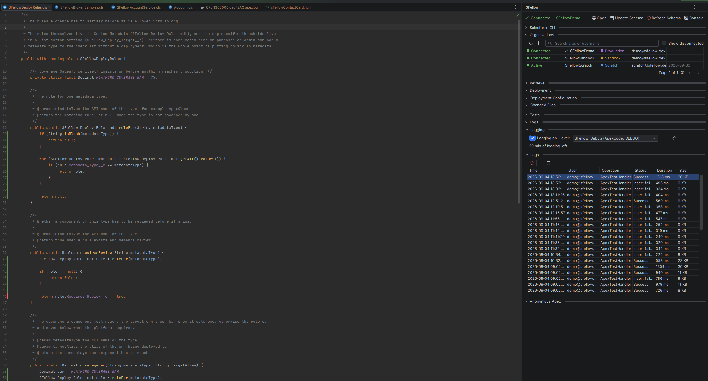

# SFellow

A Salesforce plugin for IntelliJ IDEA and WebStorm, built around the `sf` CLI.

Retrieve and deploy without leaving the editor, and write Apex, LWC, Aura and Visualforce with the editor actually
understanding what you wrote — completion, go-to-definition, find usages, hover and error highlighting, all computed
inside the IDE. Run the tests and read the debug log without leaving it either.

## What you need

- **IntelliJ IDEA 2026.1 or newer** (Ultimate or Community), or **WebStorm 2026.1 or newer**.
- **Salesforce CLI (`sf`) installed and on your `PATH`.** SFellow does not bundle it and does not authenticate on its
  own: every org it shows is an org `sf` already knows about.

## Install

1. Ask for the current build — email **karpes.dev@gmail.com**. Builds are handed out directly for now.
2. In the IDE: **Settings → Plugins → ⚙ → Install Plugin from Disk…**, pick the zip, restart.
3. Open a Salesforce project (one with an `sfdx-project.json`) and the **SFellow** tool window appears on the right.

New to the plugin? [Getting started](docs/getting-started.md) walks the first half hour end to end.

## Price and beta builds

SFellow is a paid product. The price is not set yet, and nothing in the current builds asks you for money.

What the current builds do have is an **expiry date**: each beta stops working roughly six weeks after it was built,
and you ask for a newer one to replace it. That is a beta mechanism, not a countdown to a paywall —
[Beta builds](docs/beta-builds.md) explains exactly what expires, what keeps working, and why moving your clock back
does not help.

## Documentation

| Page | What is in it |
|---|---|
| [Getting started](docs/getting-started.md) | Install → connect an org → retrieve → edit → deploy |
| [Orgs](docs/orgs.md) | Connecting production, sandbox and custom-URL orgs; default org; details; logout |
| [Retrieve](docs/retrieve.md) | Metadata browser, type search, inventory cache, manifests, managed components, folders |
| [Deploy](docs/deploy.md) | Deploying a file or a selection, changed files, deploy on save, test levels, failed tests |
| [Apex](docs/apex.md) | Highlighting, navigation, usages, hover, errors, completion, SOQL, SObjects, labels, settings |
| [Apex tests](docs/tests.md) | Running tests in the org, reading the results, coverage, the log of a single test |
| [Debug logs](docs/logs.md) | Switching logging on, the log list, reading a long log, deleting |
| [LWC, Aura, Visualforce](docs/lwc-aura-visualforce.md) | What is supported for each of the three, separately and honestly |
| [Anonymous Apex](docs/anonymous-apex.md) | Scratch buffers, running them, reading what came back |
| [Console](docs/console.md) | Operation cards, command echo, clickable errors |
| [Project and tree](docs/project.md) | New project, new components, `-meta.xml` nesting, deleting from the org |
| [Schema](docs/schema.md) | Refresh Schema, when it re-runs itself, and where it is kept |
| [Beta builds](docs/beta-builds.md) | Why builds expire and what happens when one does |
| [Troubleshooting](docs/troubleshooting.md) | `sf` not found, schema missing, plugin conflicts, where the log is |

## Bugs and requests

Open an [issue](https://github.com/karpes/SFellow/issues) and say what you did and what happened instead. Two things
make a report answerable:

- **Which IDE and which build.** **Help → About** gives the IDE and its version; **Settings → Plugins → SFellow**
  gives the SFellow build number.
- **The log, if the IDE wrote anything.** **Help → Collect Logs and Diagnostic Data** packs it into a zip you can
  attach as it is.

The source is closed; this repository is documentation, releases and issues.
