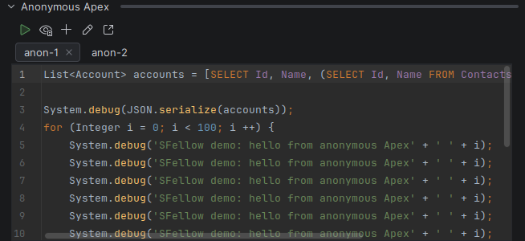

# Anonymous Apex

The Apex equivalent of a scratch pad: a few lines you want to run against an org right now, without deploying a
class to hold them.

## Buffers

**What it does.** The panel's **Anonymous Apex** section holds tabs. Each tab is a real file that survives restarts,
so the query you wrote on Monday is still there on Wednesday. **+** makes a new one, **✕** deletes it.

**When it helps.** You end up with one tab per thing you keep re-running — a count query, a debug of some flag, a
one-off fix you are about to need again.

## Writing

The buffer is a real Apex editor: highlighting, completion, navigation, and errors as you type — the compiler treats
it as anonymous Apex, so top-level statements are allowed where a class would need a method.

## Running

**Run** executes the buffer against the default org (`sf apex run`).

Results land in the [Console](console.md): the debug log, the execution outcome, and the timing.

## When it goes wrong

**A compile error** is reported with `Line N column M`, and that is a link — click it and the caret goes to the spot
in your buffer.

**A runtime exception** comes back with the Apex stack trace, whose frames are links too when they name a class in
your project.
