# Apex

The Apex support is not a syntax highlighter with autocomplete bolted on. SFellow runs Salesforce's own compiler
core — the same one behind the official tooling — **inside the IDE process**, and every feature below is an answer
from that compiler rather than a guess from a regex.

That is why `Ctrl+B` lands on the right overload, and why a type error appears in the editor before you deploy.

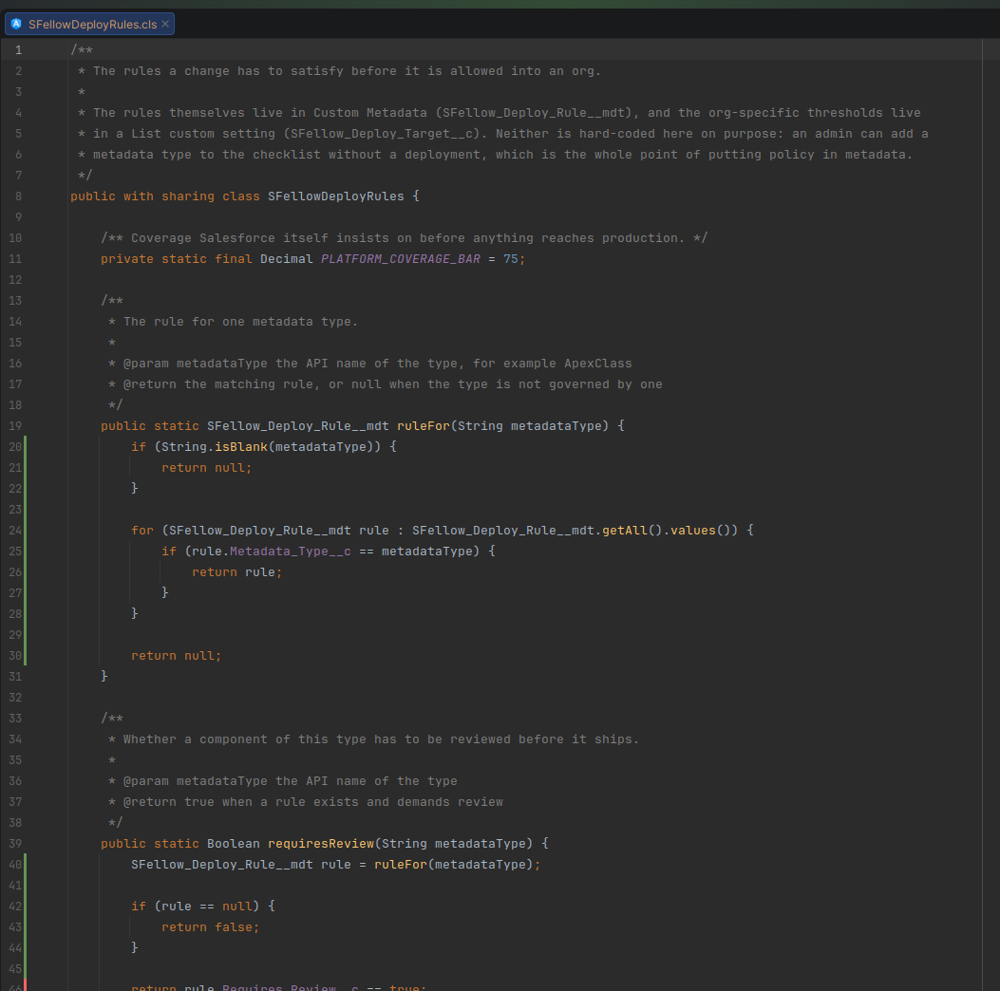

## Before any of it works: the schema

Apex is not a self-contained language. `Account.Industry` means nothing without an org to say what `Account` is.

**Refresh Schema** (in the panel) describes your default org and writes **faux classes** — generated Apex stand-ins
for every SObject, one class per object, with a field per field. The compiler resolves against those.

A fresh project has none, so its `.cls` files flag every SObject until you run it once. It re-runs itself when you
open the project and when you change default org. [Schema](schema.md) has the rest.

## Errors as you type

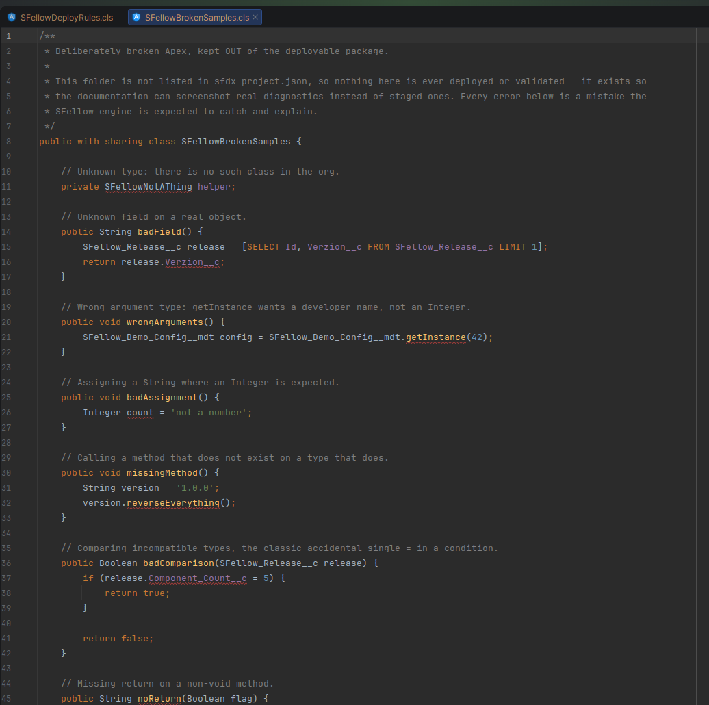

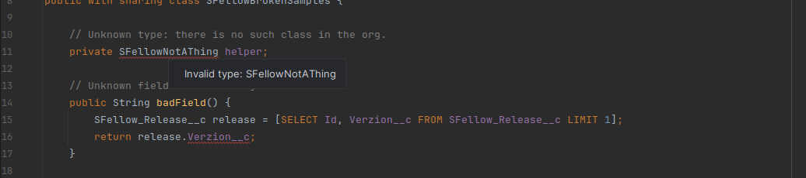

**What it does.** Compiles the file you are editing and underlines what Salesforce would reject: unknown types,
wrong argument counts, bad assignments, unresolved fields.

**When it helps.** The deploy round trip stops being how you find out you misspelled a field.

**What it does not do.** It is not a linter and has no opinions about style, naming or complexity. A class that
compiles can still fail on the org — running its tests is [a page of its own](tests.md).

## Navigation

`Ctrl+B` / `Ctrl+Click` on a type, method, field, constructor or variable.

**What it does.** Jumps to the declaration, picking the right overload by signature. It works into three places
your own source does not contain:

- **Salesforce's standard library** — `Database.insert`, `String.join`, `Schema.SObjectType`. These open as
  read-only stub classes so you can read the signature you are calling.
- **SObjects** — `Account`, your `Invoice__c`, the fields on both, via the faux classes.
- **Custom Settings** — including `getInstance` / `getOrgDefaults` / `getAll`.

**What it does not do.** It does not decompile managed packages. A method in an installed package resolves as far as
its public signature and no further, because that is all Salesforce exposes.

## Find usages

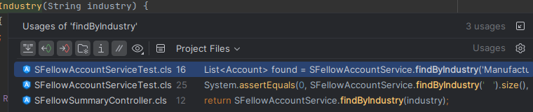

`Alt+F7` on a method, field, type, or SObject field.

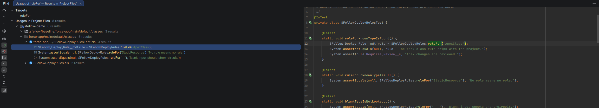

**What it does.** Finds real, resolved references — per overload. `markAsWarm(Set<Id>)` and a `markAsWarm(List<Id>)`
next to it are two different symbols and give two different answers.

**What it does not do.** It does not match text. A method name inside a comment or a string literal is not a usage
and will not be listed, which is the whole point.

## Unused code, greyed

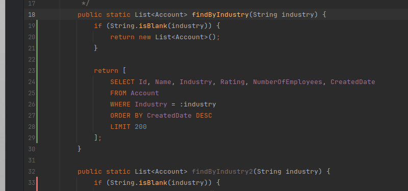

**What it does.** A method that nothing in your project names is drawn grey, the way every JetBrains IDE draws dead
code. The question is asked of the whole project, not of the open file: other classes, triggers, and the Visualforce
markup that calls a controller method by name (`action="{!save}"`) all count as callers.

**When it helps.** On the class you inherited. The methods nobody kept are visible at a glance instead of after an
afternoon of `Alt+F7`.

**What it does not do — and this is the important half.** It never greys a method Salesforce itself can call:
`global` and `webservice`, `@InvocableMethod`, `@RemoteAction`, `@future`, `@IsTest`, the `@Http*` verbs, an
`override`, and any method implementing an interface — `Database.Batchable`, `Queueable`, `Schedulable` and your
own interfaces alike. Grey reads as an invitation to delete, and none of those are safe to delete on the strength
of "nothing here calls it".

**`@AuraEnabled` gets an answer rather than an exemption.** Its callers are your components, and they normally
live in the same repository, so they are read as callers: an LWC's
`import save from '@salesforce/apex/Controller.save'` and an Aura controller's `component.get("c.save")` both
count. A Lightning method your components import keeps its colour; one that was cloned and forgotten goes grey.
In a project that carries no `lwc/` or `aura/` bundle at all the callers are somewhere this project cannot see,
and there `@AuraEnabled` is left alone entirely.

Two more things stay their normal colour. Everything, while the IDE is still building its indexes: an answer the
index has not given yet is not the answer "no usages". And a method whose name is written only in a comment or a
string is not called by it — which is the other side of the same rule: a method reached by reflection alone
(`Callable.call('doWork')`) *will* go grey, because nothing can see that call.

## Hover

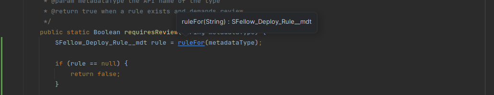

Point at a symbol and you get its signature and type: parameter types, return type, field type, and the doc comment
when there is one.

## Completion

`Ctrl+Space`, or just type a dot.

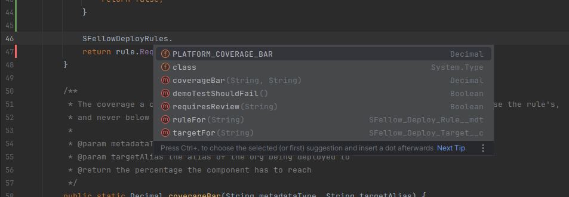

**What it does.**

- **Members after a dot** — methods and fields of whatever the expression's type actually is, with signatures.
- **SObject fields** — `account.` lists the fields your org has, custom ones included.
- **Types** — classes in your project and in the standard library.
- **SOQL** — object names after `FROM`, field names after `SELECT`, in inline queries.
- **Custom Labels** — `Label.` lists the labels retrieved from your org.
- **Visualforce pages** — `Page.` lists the pages in the org.

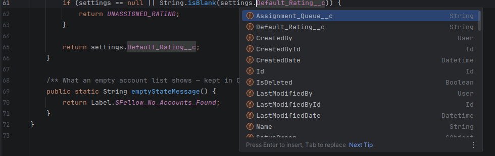

**Very expensive files.** A large project usually has a handful of files that cost seconds to analyse — normally
because of how much they reference, not because of their own length. In those, completion is limited, and a short
notice at the top of the editor says so; hover it for the measured cost and the limit it passed. Diagnostics, go to
declaration, hover and find usages keep working there, and the rest of the project is unaffected.

Custom Settings behave like any other SObject here: the hierarchy accessors resolve, and the fields you declared
complete alongside the standard ones.

**When it appears.** By itself, as you type a name or a dot — you do not have to reach for `Ctrl+Space`, though it
still works. Inside comments and string literals it stays out of your way.

**What it does not do.** In ordinary code it hides your test classes: `@IsTest` classes are not what you are reaching
for from a service class, and they used to bury what was. It also offers nothing your org has not been described to
SFellow — see the schema note at the top of this page.

## Structure

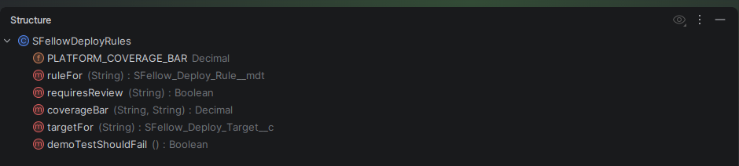

`Alt+7` gives the class as a tree — fields, properties, methods with signatures, inner classes. Synthetic members
the compiler invents (an exception subclass's generated `getMessage`, for instance) are pruned, because they are not
in your file and jumping to them goes nowhere.

## Triggers

`.trigger` files get the same treatment as classes. Internally the compiler wraps a trigger body in a synthetic
method, which is a detail worth knowing only because it is the reason declarations at the top level of a trigger
behave like fields.

## SOQL

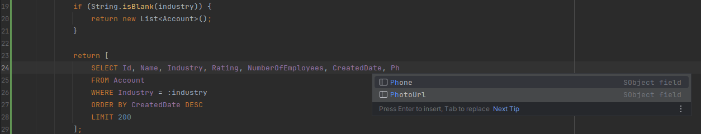

Inline queries are highlighted as SOQL rather than as one long string, and completion works inside them for object
and field names. Clicking a field inside a query navigates to the field.

## Rename

`Shift+F6` on a declaration — a class, a method, a field, a variable — renames it and every real reference to it,
counted up front so the dialog can tell you how many places are about to change.

**Two things it will not do.** It refuses on anything generated: a faux SObject, a Custom Setting accessor, a
standard-library stub. Those belong to your org or to Salesforce, and renaming them locally would only desynchronise
your project from the org.

And it waits. While the project index is still warming — first open, or just after a schema refresh — find usages is
incomplete, and a rename computed from an incomplete list silently misses call sites. Instead of that, you get a grey
hint saying the index is still building. Wait for it; it is seconds.
