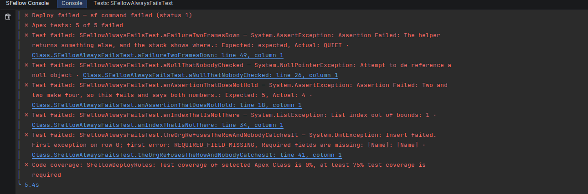
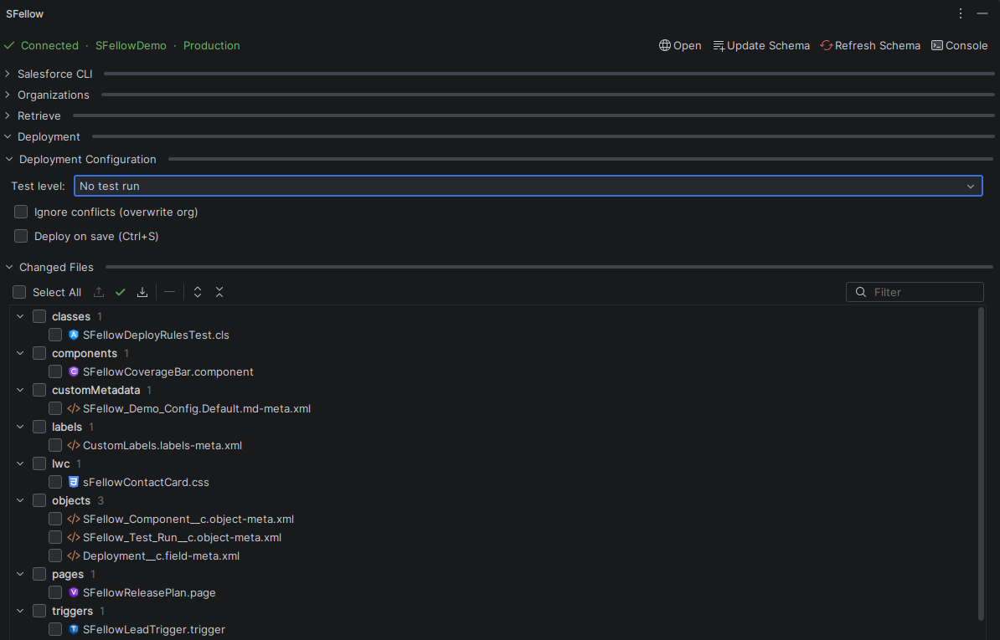
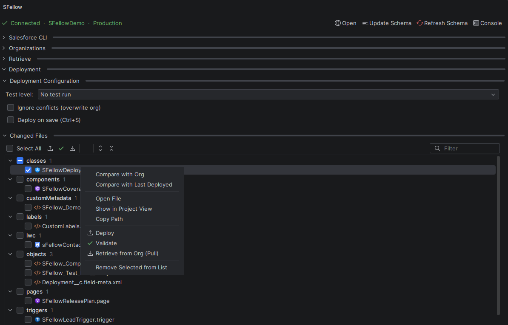
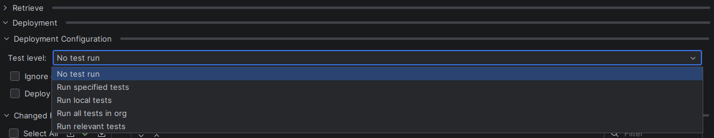

# Deploy

Getting your changes into the org, and finding out quickly when they do not go in.

## Deploying

Three ways, all running `sf project deploy start` underneath:

- **Deploy Current File** — the file in the editor;
- right-click in the project tree → **Deploy** — whatever you selected, one file or a folder;
- **Changed Files** — everything that differs from what last went to the org.

**What it does not do.** It does not resolve conflicts. If somebody changed the same component in the org, the deploy
fails on a conflict and you decide what to do — SFellow will not pick a winner for you.

## Changed files

**What it does.** Everything that differs from the version that last went to the org, as a tree grouped by metadata
type. Tick what you want and press **Deploy**, or **Validate** to rehearse it. **Select All** takes the lot, and
**Filter** narrows a long list.

A file leaves the list when it goes to the org — and also when you undo your way back to the deployed version, since
at that point there is nothing left to deploy.

**When it helps.** Ten minutes of edits across four classes and a trigger, one deploy.

**Seeing what changed.** Double-click a row to open the file, or right-click it:

| Action | What you get |
|---|---|
| **Compare with Last Deployed** | a diff against the version that last went to the org — no org call, so it works offline |
| **Compare with Org** | a diff against what is in the org right now, fetched for the comparison |
| **Retrieve from Org (Pull)** | the org's version replaces what is on disk, after confirming |
| **Open File**, **Show in Project View**, **Copy Path** | the usual ways to get to the file |
| **Remove Selected from List** | drops rows you do not intend to deploy |

**Compare with Last Deployed** reads the text in your editor, so an unsaved edit shows up in the diff.

## Deploy on save

Turn it on and `Ctrl+S` deploys the file you just saved.

Only `Ctrl+S` counts. The IDE saves files by itself all the time — when you switch windows, when you run something —
and none of those deploy anything.

**All changes**, next to the checkbox, widens it: a save deploys everything you have changed, not only the file in
front of you.

**When it helps.** A tight edit-and-check loop against your own sandbox or scratch org.

**Worth knowing before you turn it on.** On a shared sandbox every save of yours is immediately everyone's, including
the half-written version. Check which org the panel is pointed at.

## Test levels

Pick one before you deploy:

| Level | What Salesforce runs |
|---|---|
| No test run | nothing |
| Run specified tests | the classes you name |
| Run local tests | every test in the org except managed-package ones |
| Run all tests in org | everything, managed packages included |
| Run relevant tests | the tests Salesforce judges relevant to what you are deploying |

Production deploys require a level with real coverage; sandboxes do not. This is a Salesforce rule, not ours.

## Validate

**Validate** runs the whole deployment without committing it — compilation, tests, coverage — so you find out whether
a release goes in before it goes in.

**When it helps.** Rehearsing a production release, or checking a large change against a sandbox without leaving it
there.

## When tests fail

The console prints each failing test with its message and stack trace, and the stack frames are **links** — click one
and you are on the line in your class.

Coverage is a page of its own — see [Apex tests](tests.md) for per-class percentages and the lines that were not
covered.

## Deleting from the org

Delete a component's file in the project tree and SFellow offers to delete it from the org too
(`sf project delete source`). Say no and only the local file goes.

**What it does not do.** It does not delete in bulk from the tree, and it does not build a `destructiveChanges.xml`.
