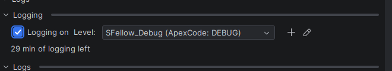
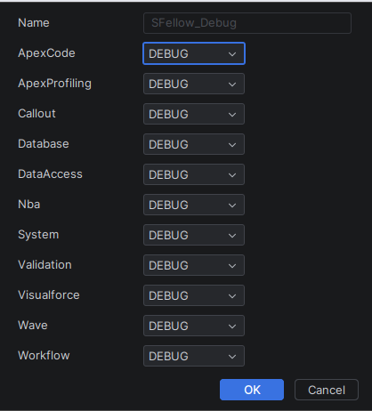
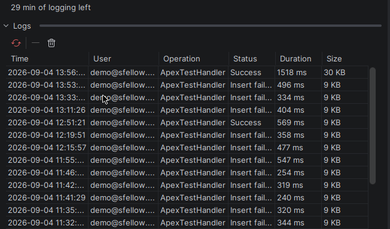
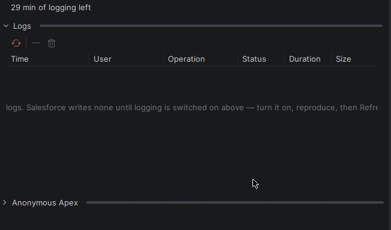
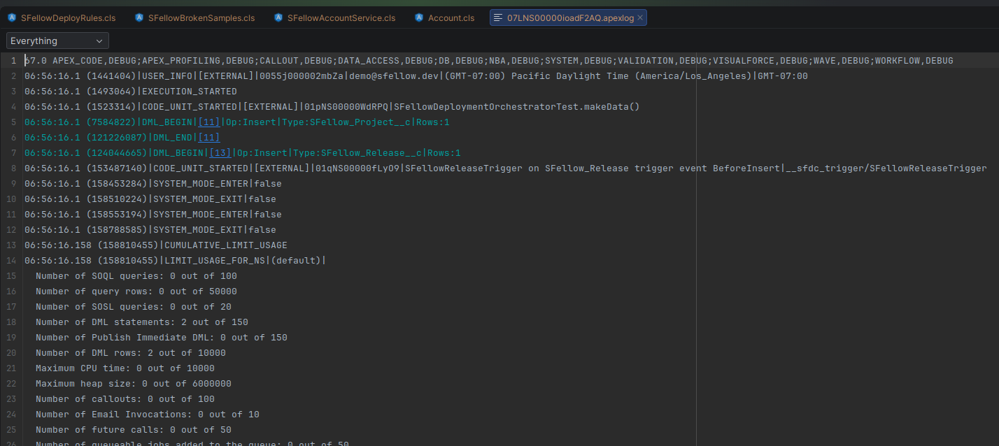
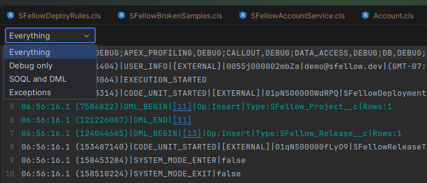

# Debug logs

Salesforce writes a debug log only while logging is switched on for you, and keeps it for a while afterwards. The
panel's **Logs** section is both halves of that: the switch, and the logs it produced.

## Switching logging on

**Logging** sits at the top of the section: a switch, a **Level**, and a line saying where you stand — *Off*,
*N min of logging left*, or *Expired*. Salesforce expires the setting on its own; SFellow asks for thirty minutes
and shows you the countdown, so a log that stopped appearing has a visible reason.

**Levels.** Two are ready to use: **SFellow_Debug** for ordinary work, and **SFellow_Profiling** when you need
timings. Any debug level your org already has is in the list too, and is used exactly as its owner set it up.

**New level…** and **Edit level…** give you a name and the eleven categories Salesforce keeps on a level, each with
its own severity.

**Profiling logs everything.** Eight lines of Apex under it produce hundreds of kilobytes; a real transaction hits
Salesforce's 20 MB ceiling and comes back truncated. Reach for it when you need timings, not as a default.

## The log list

**What it does.** Your most recent logs, newest first: **Time**, **User**, **Operation**, **Status**, **Duration**
and **Size**. **Refresh** brings the list up to date.

**When it helps.** You reproduce something, press Refresh, and the log of what you just did is the top row.

The list refreshes when you ask it to and at no other time — a deploy or a test run never quietly re-reads it behind
your back.

## Reading a log

Double-click a row and the log opens in the viewer.

**Pages.** Logs get long, so the viewer shows them a page at a time, with **◀** and **▶** and the page number.

**Projections.** The dropdown narrows the log to what you are actually after: **Everything**, **Debug only**,
**SOQL and DML**, or **Exceptions**.

Downloaded logs stay in the project as `.apexlog` files, so a log you opened once opens again from the project tree,
Recent Files or Go to File — and from a test in the [test results](tests.md), which is the same viewer.

## Deleting

**Delete the selected log** removes one; **Delete every log** clears out every log the org is holding for you, after
asking. Both delete in the org, not just from the list.
