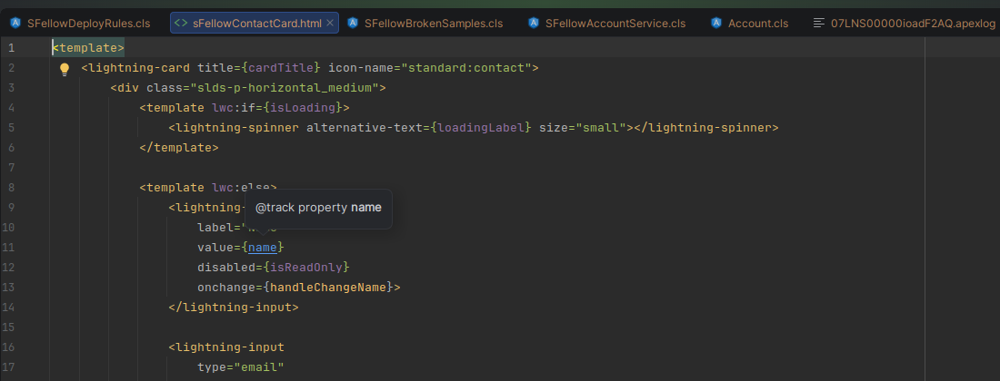

# LWC, Aura and Visualforce

Three technologies, three very different levels of support. This page says which is which, because "we support
Aura" without a qualifier is how you end up disappointed on day two.

| | Level today |
|---|---|
| **Lightning Web Components** | **Supported** — template, script and stylesheet |
| **Aura** | 🚧 **Coming soon** — a first layer works today |
| **Visualforce** | 🚧 **Coming soon** — a first layer works today |

**LWC is the one that is done.** That is where the work has gone and where it keeps going: the whole bundle, all the
way down.

Aura and Visualforce are not there yet. A first layer is in place and useful — you will not be reading a `.cmp` as
grey text — but it is a fraction of what LWC gets, and the rest comes after release.

## Lightning Web Components

A bundle is a folder — `.html`, `.js`, `.css`, `.js-meta.xml` — and SFellow reads all of it as one component.

### The template

**Bindings.** Every `{name}` in a template is a real reference to a member of the component's class. Completion
inside the braces, `Ctrl+Click` to the member, hover for its kind and signature, and `Alt+F7` from the member back
to the template.

Nested paths work too: `{contact.email}` resolves through an object literal declared in the `.js`.

**Your own components.** `<c-child-card>` completes, navigates to the child bundle, and finds usages. Renaming a
component renames the folder, its files, every tag and every import in one step.

**Base components.** The `lightning-*` tags and their attributes come from the catalog Salesforce ships, not from a
hand-written list, so they match the version you are on. Hover shows the description and the attribute type.

**Directives.** `for:each`, `for:item`, `key`, `lwc:if`, `lwc:else`, `if:true` — completed, and not flagged as
unknown HTML attributes the way plain HTML support would flag them.

### The script

**You need the IDE's JavaScript support switched on for this half.** WebStorm has it; IntelliJ IDEA has had it since
2026.1, Community included. With the JavaScript plugin disabled the template half keeps working and the script half
goes quiet.

**Imports.** `@salesforce/label/c.X`, `@salesforce/apex/MyClass.myMethod`, `@salesforce/schema/...`, the `lightning/*`
modules, and relative imports of your own project's exports — all complete, resolve and navigate. An import that
resolves to nothing is highlighted.

For `@AuraEnabled` Apex methods that means going from the LWC straight into the Apex class, and finding every LWC
that calls a given method from the Apex side.

**`this.` members.** Fields, getters, methods and the `LightningElement` API itself.

**`querySelector`.** Your own component tags are recognised inside selector strings instead of being flagged.

### The stylesheet

Classes you declare in the bundle's `.css` complete inside `class=` in the template.

### What completes, in one list

Completion comes up as you type — you do not have to ask for it.

- **In the template:** members of your class inside `{…}`, your own `<c-…>` tags and the `@api` attributes they
  declare, the `lightning-*` base components and their attributes, the LWC directives, and CSS class names inside
  `class=`.
- **In the script:** `this.` members, the `lightning/*` modules, the `@salesforce/*` imports — labels, Apex methods,
  schema — and your own project's exports.
- **In the stylesheet:** the bundle's own custom properties and the SLDS design tokens.

### SLDS

SLDS class names complete inside `class=`, and SLDS design tokens complete in the stylesheet. Both come from the
catalog Salesforce ships, not from a list somebody typed by hand.

Both also have a **declaration you can open**: `Ctrl+Click` an SLDS class or token and the editor opens the generated
declarations at that exact line, so you can read what it is instead of searching for it on the web. Hover gives the
short version without leaving the file — for a token, its default value and which SLDS package it came from.

## Aura 🚧 Coming soon

Aura support is an early layer, frozen at what you see here until after release.

## Visualforce 🚧 Coming soon

The same story as Aura: an early layer, frozen until after release.
