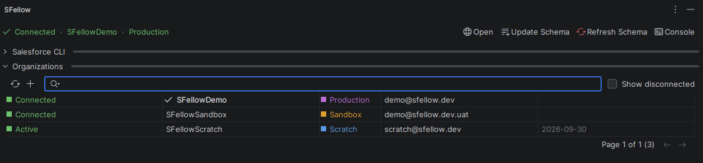
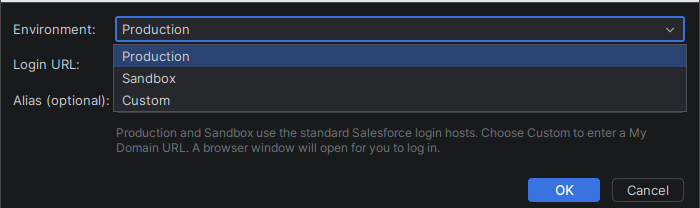
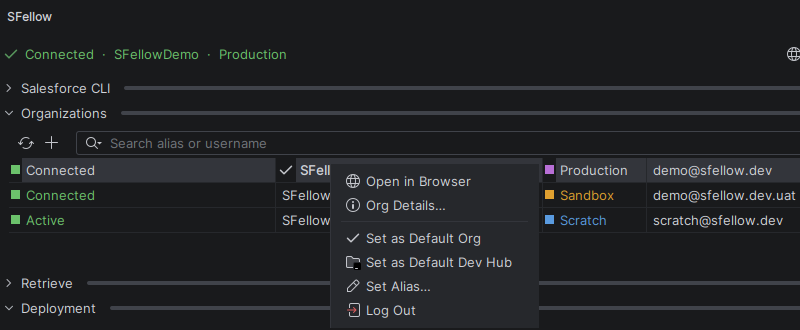
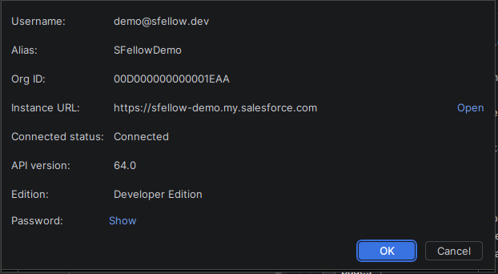

# Orgs

Everything SFellow does against Salesforce goes through an org the `sf` CLI already knows about. The panel is a view
onto `sf org list` and friends — it does not keep its own copy of your credentials and does not authenticate on its
own.

That has a practical upside: an org you connected in a terminal shows up here too, and one you connect here works in
your terminal five seconds later.

## The list

The **Orgs** section shows every authorized org with its alias, username, type and connection status.

**What it does.** Shows aliases, usernames and org ids; marks which org is the default target and which is the
default Dev Hub; shows scratch-org expiry dates; lets you filter and hide disconnected orgs.

**When it helps.** When you have eleven orgs and three of them are called something like `uat2`.

## Connecting

**Connect** asks where the org lives before it opens a browser:

| Choice | Where it logs in |
|---|---|
| Production / Developer | `https://login.salesforce.com` |
| Sandbox | `https://test.salesforce.com` |
| Custom URL | a My Domain you type in |

The sandbox choice matters more than it looks: a sandbox user logging in against `login.salesforce.com` gets a
confusing failure rather than a clear one, and this is the switch that avoids it.

The browser flow has a **one-minute** timeout and a cancel button. If you close the browser tab, or wander off, the
panel stops waiting and says so instead of hanging.

## The default org

Right-click an org → **Set as Default Org**. That runs `sf config set target-org`, the same setting the CLI reads,
so it applies to your terminal too.

The default org is what retrieve, deploy, anonymous Apex and Refresh Schema all run against. Changing it is not a
cosmetic act:

- the Retrieve tree resets — the old org's inventory is not the new org's inventory;
- the schema regenerates, because the faux SObject classes belong to the org they were described from.

If you change `target-org` **outside** the plugin — in a terminal, say — SFellow notices (it watches the CLI's own
config files) and refreshes the schema for you. See [Schema](schema.md).

**Dev Hub.** *Set as Default Dev Hub* does the same for `target-dev-hub`.

## Org details

Right-click → **Details** (or the details button) runs `sf org display` and shows what came back: username, org id,
instance URL, API version, edition, connection status, and for scratch orgs the expiry date.

Every value is click-to-copy. This exists because the alternative was reading an 18-character org id off the screen
and typing it somewhere.

**Password.** If the org user has a locally generated password, **Show** reveals it — that is `sf org auth
show-user-password`, run only when you press the button and never as part of the ordinary details load. Most orgs
have no such password, and the dialog says so plainly instead of showing an error: a password only exists when it was
generated locally, typically for a scratch org.

## Renaming an alias

Right-click → rename. The org ends up with exactly one alias: the old one is unset before the new one is set, so you
do not accumulate three names pointing at the same username.

## Opening and logging out

**Open** launches the org in your browser with an already-authenticated session (`sf org open`).

**Logout** removes the local authorization (`sf org logout`). It does not touch anything inside Salesforce — the user
is not deactivated, sessions elsewhere are unaffected, and you can log back in immediately.
