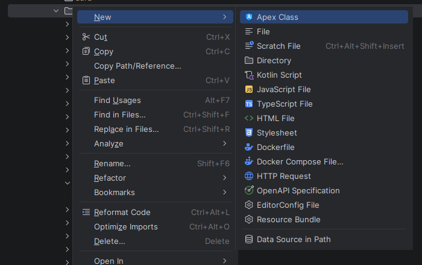
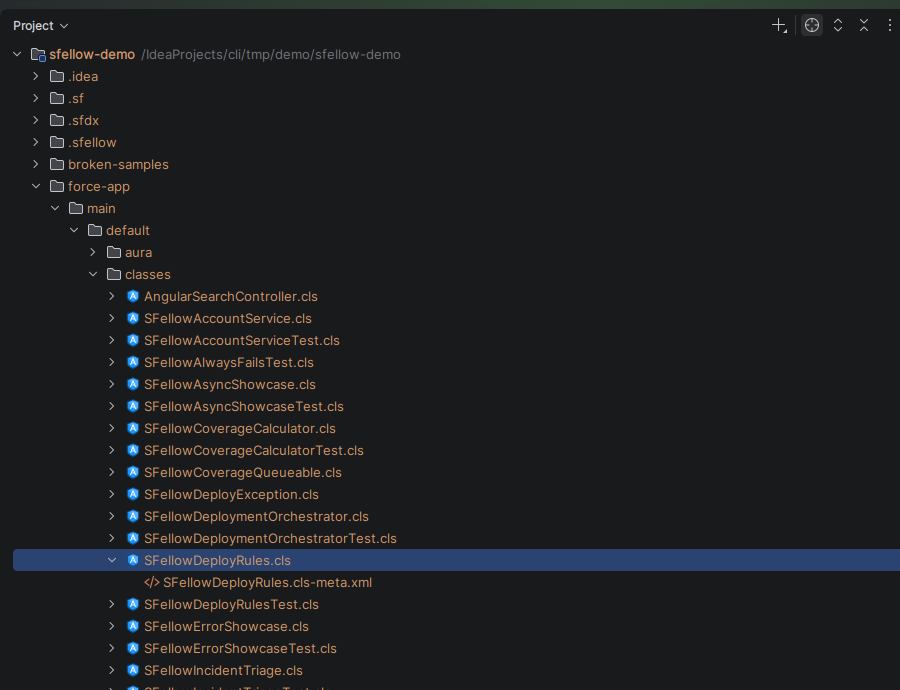

# Project and tree

## A new project

**File → New → Project → Salesforce** runs `sf project generate` and opens the result.

Straight after, SFellow offers to connect an org and retrieve from it — because an empty SFDX project is not much
use, and the two commands you were about to run anyway are one click each.

## New components

**New → SFellow** in the project tree creates the six things you make most often, with both halves —
the source file and its `-meta.xml` — in the right folder:

Apex class · Apex trigger · Lightning Web Component · Aura component · Visualforce page · Visualforce component

The templates are plain and direct: a class is a class, not a scaffold with five TODOs in it.

**What it does not do.** It does not deploy what it created. A new class exists locally until you deploy it.

## The `-meta.xml` nesting

Apex classes, triggers, LWC and Aura bundles, Visualforce pages and components — everything that comes with a
companion `-meta.xml` — keep that file tucked under the source file instead of next to it. Click the arrow on the
source file when you need it.

So `classes/` reads as a list of classes, not as a list of pairs.

## Deleting from the org

Delete a component in the project tree and SFellow asks whether to delete it from the org as well
(`sf project delete source`). Say no and only the local file goes.

The offer appears **after** the local delete, not instead of it — the file is gone either way, and the question is
only about the org.

**What it does not do.** No bulk delete, no `destructiveChanges.xml`, and no undo of the org-side delete.
