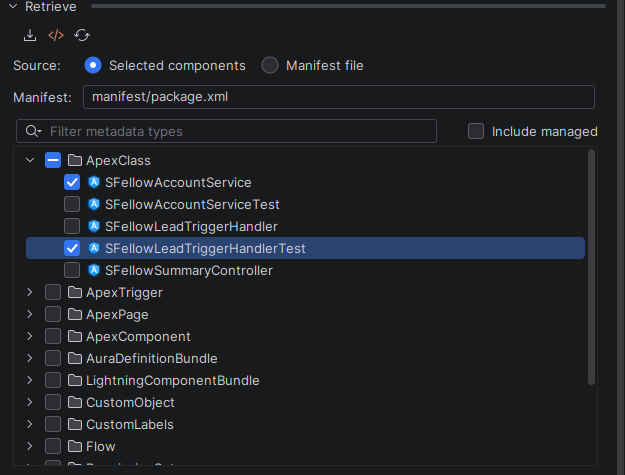

# Retrieve

Pulling metadata out of an org, without writing a `package.xml` by hand and without guessing what is in there.

The **Retrieve** section browses your default org's metadata inventory as a tree: types at the top level, components
underneath, checkboxes on both.

## Browsing

**What it does.** Lists every metadata type the org reports, and — when you expand one — the components of that type.
Tick whatever you want and press **Retrieve**; the files land in your project's default package directory.

**When it helps.** Onboarding onto an org you did not build. "What Apex is even in here" is one expand away.

**What it does not do.** It does not show you a diff against your local copy, and it does not warn you that a
retrieve will overwrite local changes. Retrieve writes files. Commit first.

## Finding a type

An org reports roughly two hundred metadata types, and until you know the exact XML name, scrolling is the only tool
you have. The filter box above the tree narrows the list as you type.

Filtering happens locally — no command is sent to the org — so it is instant. Ticks on types that scroll out of the
filter are **kept**, not silently dropped: filter to `Apex`, tick `ApexClass`, filter to `Flow`, tick `Flow`, and
both are in your selection.

## The inventory cache

The first expand of a type asks the org. After that the answer is cached to disk, one file per org, and survives
restarting the IDE.

**When it helps.** Browsing a large org stops costing a round trip per click.

**Refreshing.** Two levels, both explicit:

- refresh **one type** — you just deployed a class and want it in the list;
- refresh **everything** — the org changed under you.

There is no "re-list" that keeps the old data: re-listing and forgetting what you knew are the same act, so the
refresh drops the cache and asks again.

## Managed components

**Include managed components** is off by default.

Components that came from an installed package are read-only in your org, and in a package-heavy org they outnumber
your own code by an order of magnitude. Hidden by default, the tree shows what you can actually change.

The filter decides on the Metadata API's own `manageableState`, not on the namespace: standard components report a
blank namespace, so a namespace-only rule would hide the wrong things.

Turning the checkbox off clears ticks on components it hides — leaving something ticked but invisible in your
selection is how you retrieve a surprise. Expanded nodes stay expanded.

## Folder types

`Report`, `Dashboard`, `Document` and `EmailTemplate` live in folders, and folders nest.

**What it does.** Walks the real folder hierarchy, lets you tick a whole folder, and builds a correct `-m` selection
from it.

**Why it needed special handling.** A flat metadata listing does not return the hierarchy at all — the nesting comes
from querying the `Folder` object. Without that, a nested report folder is invisible.

## Retrieving by manifest

Two ways in:

- **Retrieve by manifest** — point at a `package.xml` you already have and pull exactly that;
- the browser's own **Retrieve** — which also goes through a manifest, generated from your ticks.

The browser writes a manifest rather than passing `-m` flags because a large selection runs into the operating
system's command-length limit.

**Package** generates a `package.xml` from your selection without retrieving, for when the manifest is the artefact
you wanted.

**What it does not do.** No destructive changes (`destructiveChanges.xml`), no manifest editing UI, and no merging of
two manifests.

## What comes back

Every retrieve prints a card in the [Console](console.md): the command, the component list, how long it took. For a
folder fan-out it is one card naming the folder, not one card per folder.

## Retrieving a single file

Right-click a file in the project tree → **Retrieve from Org** pulls just that component down again. Useful when
somebody changed a class in the org and you want their version.
