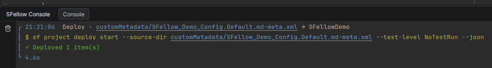

# Schema

Apex cannot be understood without an org. `Account.Industry` is only a valid expression because some org says
`Account` has an `Industry`. So before the editor can do anything intelligent with your Apex, it needs to be told
what your org contains.

## What Refresh Schema does

**Refresh Schema** in the panel header describes your default org and writes:

- **faux classes** — one generated Apex class per SObject, standard and custom, with a member per field. These are
  what the compiler resolves `Account`, `Invoice__c` and their fields against;
- **Custom Labels** — so `Label.X` completes and resolves;
- **Visualforce pages** — so `Page.X` does the same.

Everything lands under `.sfellow/` in the project, along with a marker recording **which org it came from, when, and
how much**.

## Refresh Schema and Update Schema

There are two buttons in the panel header, and the difference is what they look at.

**Refresh Schema** describes the whole org. It is the one to press after a Salesforce release, after something was
deleted, or whenever you are not sure what changed.

**Update Schema** describes only what changed since the last refresh: objects that appeared, and objects whose
custom fields were edited. Custom Labels and Visualforce pages are updated the same way. This is the button for the
everyday case — you added a field in Setup two minutes ago and want the editor to know about it.

Two things it will not catch, and both are what the full refresh is for: **deletions** — a field, object or label
removed in the org — and **standard fields that arrive with a Salesforce release**.

## When it runs by itself

You will rarely press the button:

- **on opening the project**, if there is no schema on disk, or the one there belongs to a different org;
- **when you change default org** — from the panel or from a terminal. SFellow watches the CLI's own config files, so
  a `sf config set target-org` you ran elsewhere is noticed.

Add a field in Setup and it is not there until you refresh: press **Update Schema** and it is.

## How long it takes

Proportional to the org. A small developer org is seconds; a large org with well over a thousand objects is around a
minute. It runs in the background with a progress line in the panel, and you can keep editing while it goes.

## Namespaces

If your org has a namespace, SFellow finds out (one query) and takes it into account when generating the faux
classes, so `ns__Object__c` resolves the way it does in the org.

## Where it lives

`.sfellow/` in your project root. It is generated, machine-specific and tied to one org — do not commit it.
