# Apex tests

Salesforce runs your tests, not the IDE. Every run started here is a run in your default org, and the results come
back into the editor you started it from.

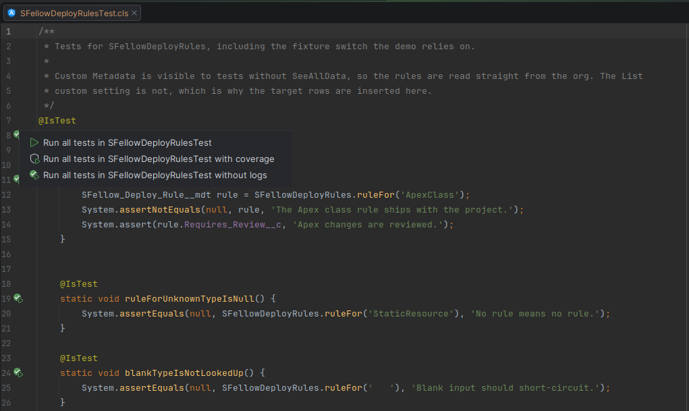

## Starting a run

Four places, all reaching the same runner:

- **The gutter** — a run arrow next to every `@IsTest` class and next to each of its test methods.
- **Right-click → SFellow → Run Apex Tests**, in the editor or in the project tree. On a folder it collects the
  `@IsTest` classes underneath, however deep they sit.

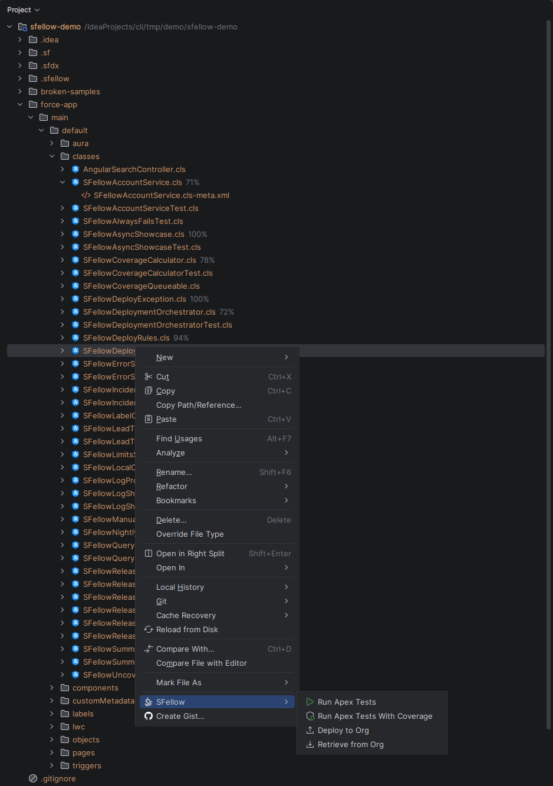
- **The Tests section** of the panel — tick classes and methods, press Run.
- `Ctrl+Shift+F10`, or a saved **Apex Tests** run configuration.

**With coverage** is offered alongside every one of them, and a class can also be run **without logs**.

**The gutter icon remembers how it went.** An arrow before anything has run, a green tick after a run that passed,
a red mark after one that failed — with the class taking the mark of its worst method.

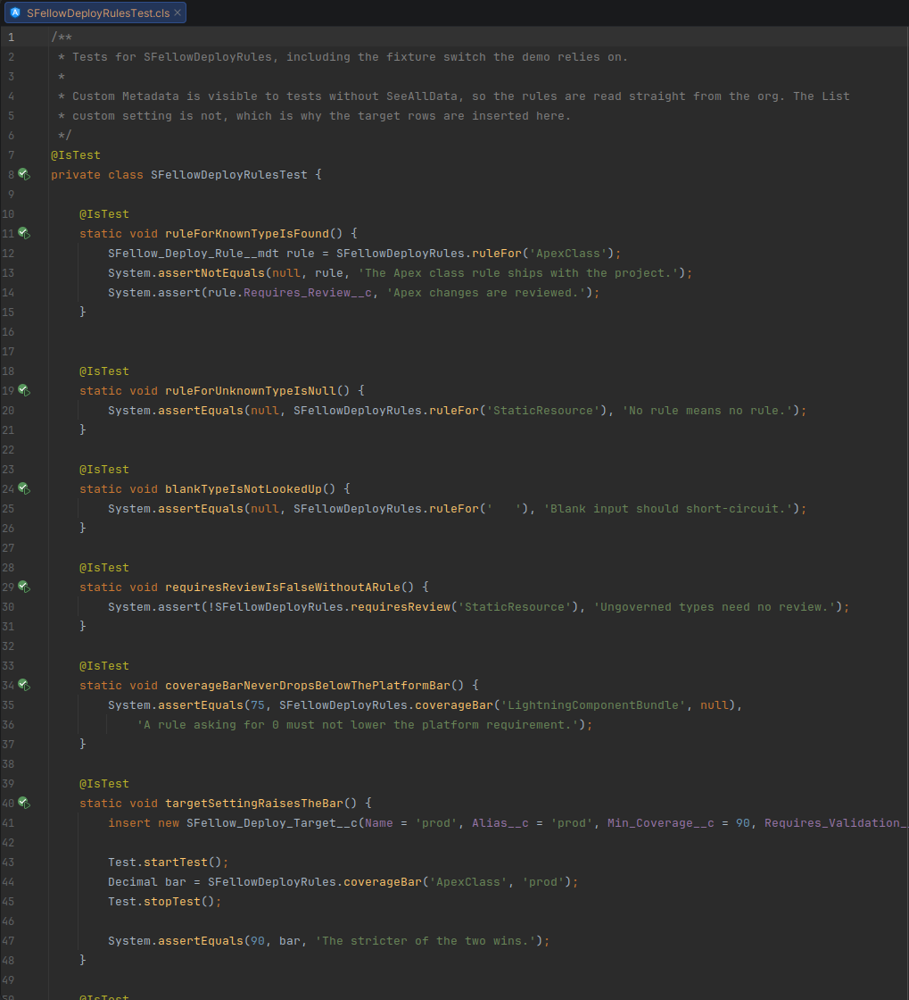

## Deploy and run

A test run executes what is in the org. So when a class in the run has local changes that were never deployed,
SFellow asks first — *Run tests against the version in the org?*

- **Deploy and run** deploys those classes and starts the run once the deploy is through.
- **Run anyway** runs the version the org already has.

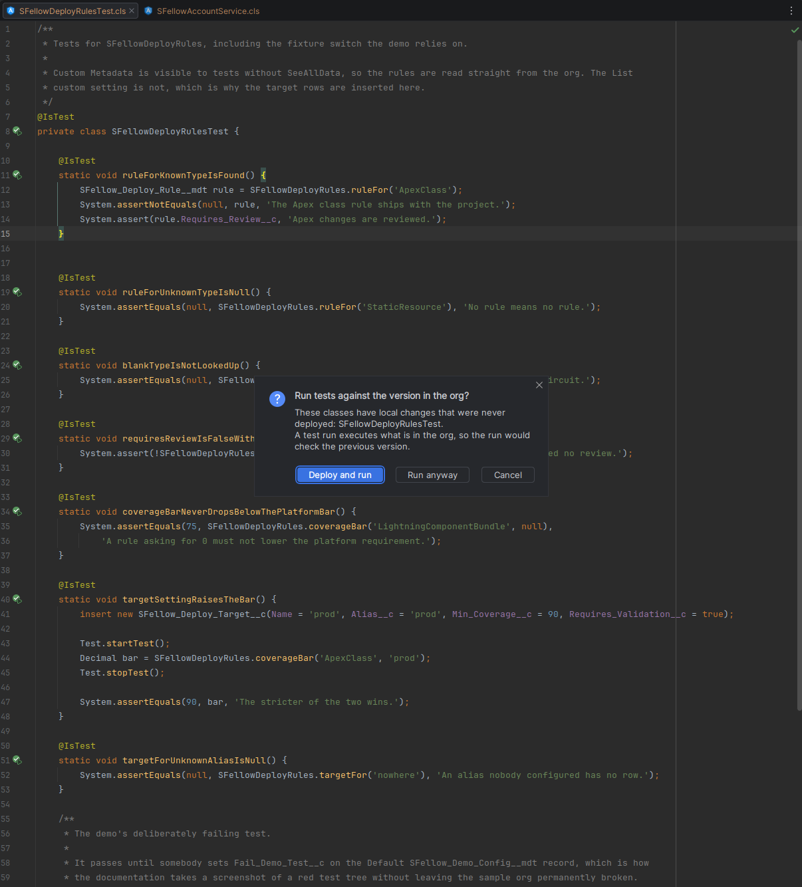

**When it helps.** Editing a test and pressing run no longer quietly re-checks yesterday's code and reports it as
passing.

## Reading the results

Results open as a **Tests: …** tab in the SFellow tool window, next to the console.

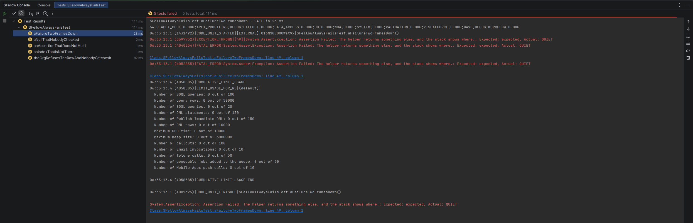

**What it does.** Fills the tree while the run is still going; double-click a method to land on its line; a failure
brings its assertion and stack trace, and the frames are links. **Rerun** and **Stop** sit in the tab's toolbar —
Stop aborts the run inside the org. Beside the tree, the run prints its totals and each class with its methods and
their durations.

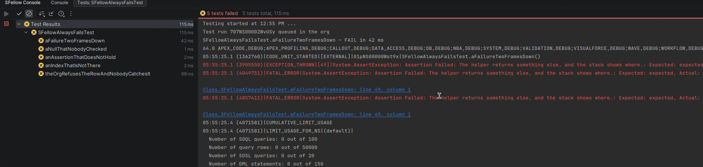

## The debug log of a test

Salesforce writes a debug log only while logging is on, so a test run **switches it on for its own length and puts
it back** afterwards. Logging you turned on yourself is left alone.

Under each test node is that test's log. Right-click a test → **Open the Test's Debug Log** opens the whole thing in
the [log viewer](logs.md).

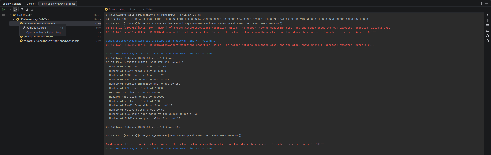

## Coverage

Run with coverage and the org reports which lines your tests executed.

**What it does.** Green and red stripes in the gutter, the IDE's **Coverage** window, percentages in the project
tree, and a **Coverage** subsection in the panel: class, percentage, lines, with anything under 75 % marked. The
subsection says where its numbers came from and when — **Last test run** or **Accumulated in the org** — and
**Fetch coverage from org** pulls the latter. **Show in editor** turns the stripes off and on.

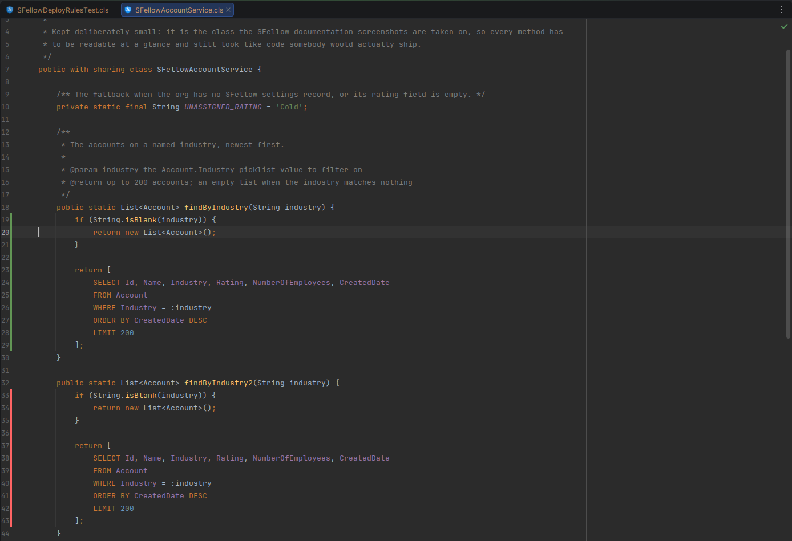

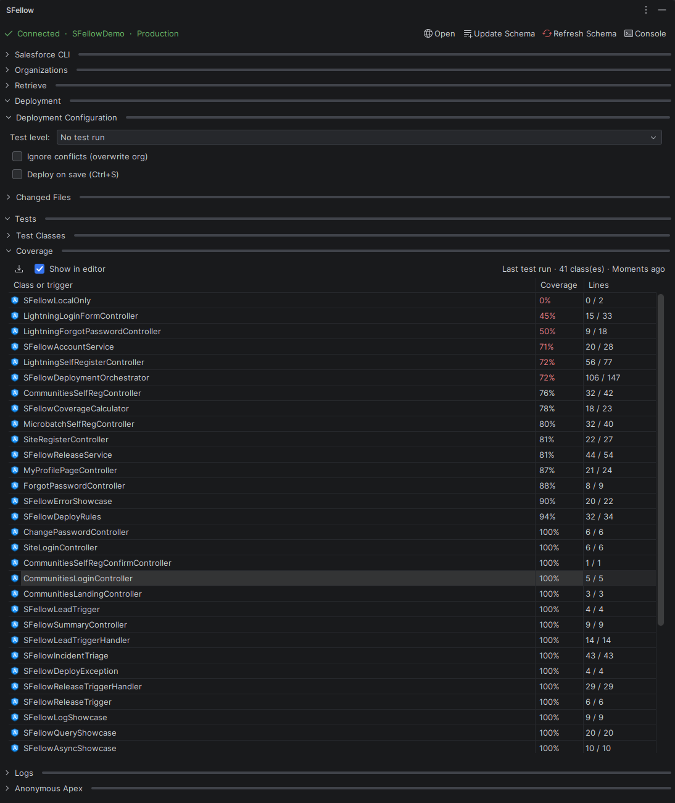

**When it helps.** Production deploys need coverage, and this is where you find out you are short of it before the
deploy tells you.

**What it does not do.** It does not treat unmeasured code as untested: a class that was not part of the run is left
alone rather than painted red and called `0 %`.

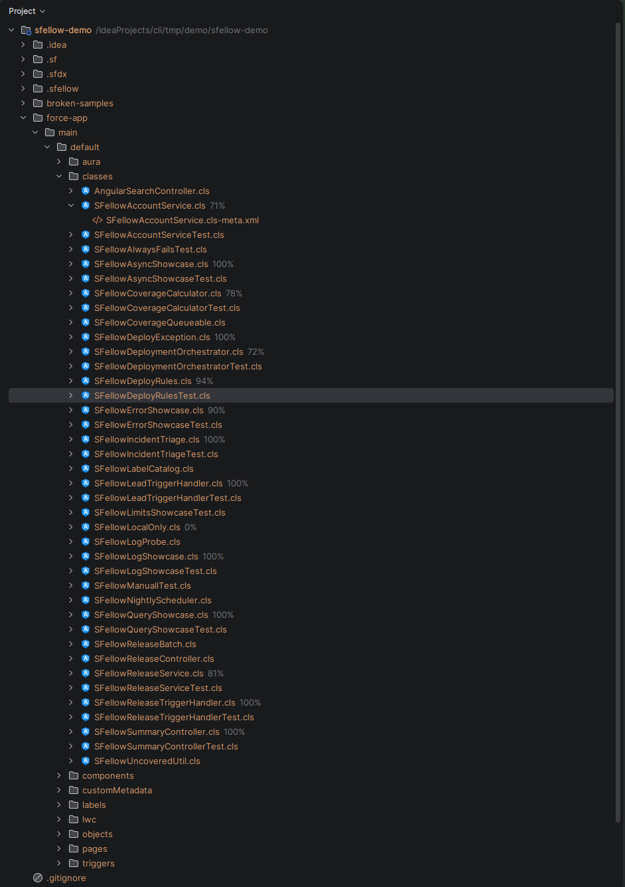

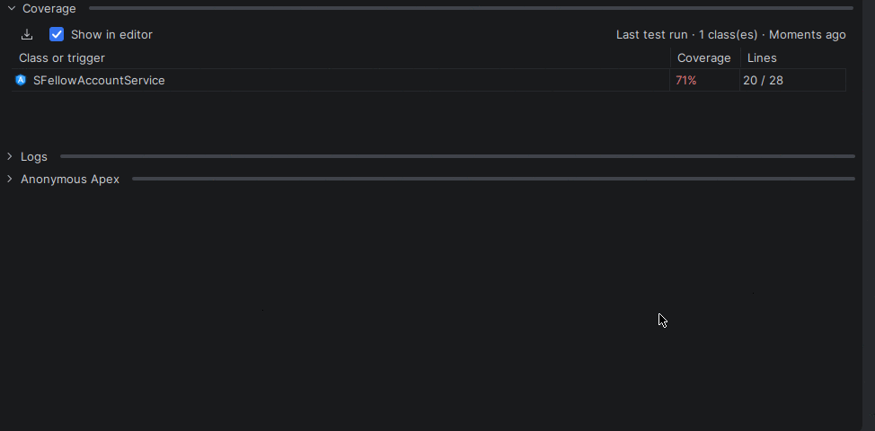

## The Tests section

The panel's **Tests** section lists every `@IsTest` class in the project and keeps itself up to date as you add
them.

**What it does.** Expand a class to get its methods; tick any mixture of classes and methods; run them with
**Run selected tests**, **Run selected tests with coverage** or **Run Without Logs**. **Select All** takes the lot.
`@TestSetup` methods and helpers are not offered — they are not tests, and the org would refuse to run them.

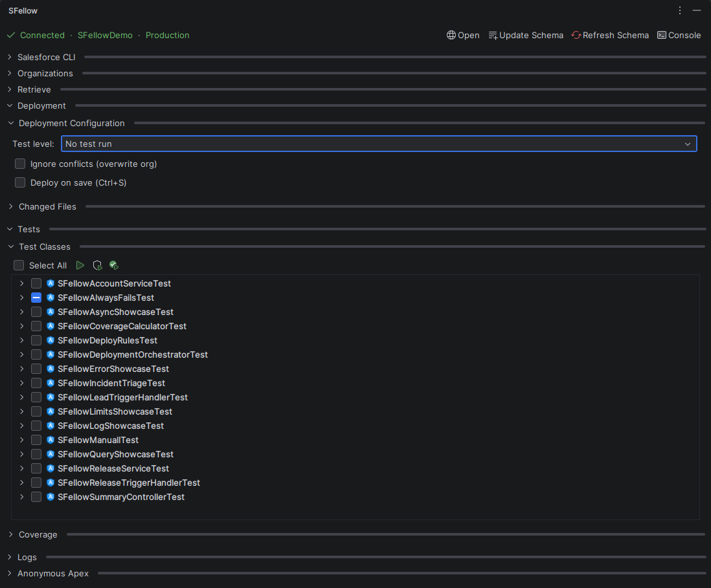

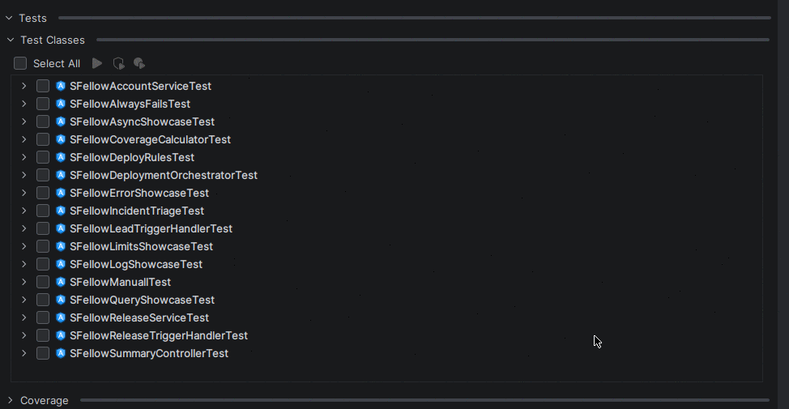

**When it helps.** Running the six classes around the thing you just changed, without opening any of them.
